# **Yoga-Emporium**
## Milestone_Project-4_Code-Institute
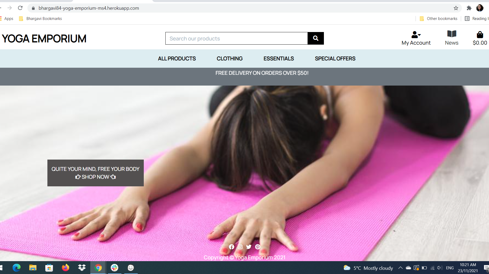
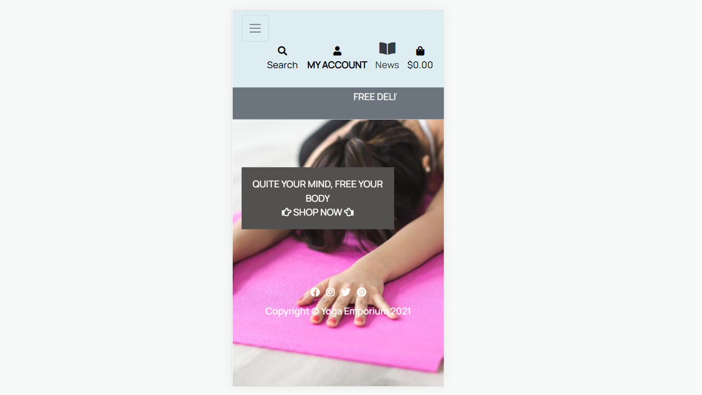
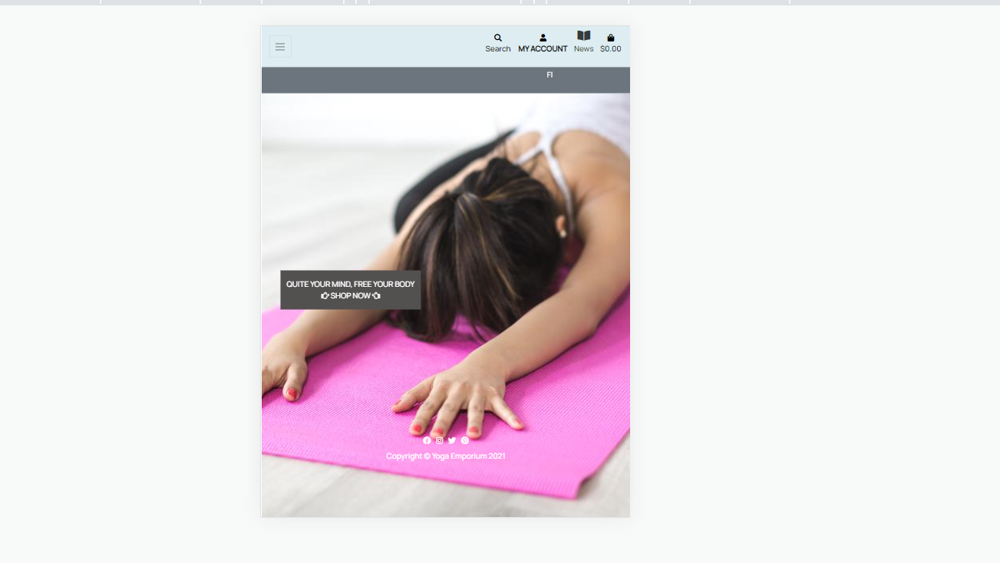
____
# **About**
### 
* This is an ultimate e-commerce store for all yoga essentials like Mat, blocks, belts and so on, where users can view the details of products and purchase the products.
* This e-commerce project is developed using the gitpod IDE and the code is pushed to the github repository. From github, the code is then deployed to Heroku.
* This project also uses stripe payment solutions for secure payments.
* This project also loads the statis files from AWS S3 bucket, where the images are stored in .jpg and .png format.
____

:point_right:
[Live Demo]()
# **Contents**

* [UX](#ux)
* [Strategy](#strategy)
* [Scope](#scope)
* [Structure](#structure)
* [Skeleton](#skeleton)
    * [Wireframes](#wireframes)
    * [Database Diagram](#database-diagram)
* [Surface](#surface)
* [Technologies](#technologies-used) 
* [Features](#features) 
* [Testing](#testing)
    * [Code Vaidity](#code-validity)
    * [Testing User Stories](#testing-user-stories)
    * [Functionality testing](#functionality-testing)
    * [Usability Testing](#usability-testing)
    * [Performance testing](#performance-testing) 

* [Deployment](#deployment)
* [Credits](#credits)
* [Acknowledgements](#acknowledgements)

## UX
### **User Stories**
### Ideal user
* The ideal user of this e-commerce site would be yoga participants or yoga lovers, users who wants to do yoga practice, users who can read and write in English. The user who wants to buy comfortable clothes for exercise, or simply use it for daily wear.
### Visitors to this website are searching for:-

* The website users searching for the available products. They found the attractive images or products with less price with Or otherwise, they want to buy the products for necessity.

* Easily view total of my purchases anytime so that spending too much can be avoided.
## **User stories - guest users/non-registered users**
*   As a guest user to yoga emporium website, I want to easily navigate through the site, so that I can find the products which I need for my yoga practice, which can also be sorted by category, size, price, names and rating.
*   As a guest user to the yoga emporium website, I want register functions, so that I can have my own profile created.
*   As a guest user to the yoga emporium website, I want to use the search panel to find products by category or description.
*   As a guest user to the yoga emporium website, I want to see the links to different social media accounts, to contact or follow the website for more informations on social media.
## **User stories - registered users**
*   As a registered user to the yoga emporium website, I want to easily navigate through the site, so that I can find the products I need that will be suitable for my yoga practice.
*   As a registered user to the yoga emporium website, I want to have log-in /log-out function, using which I can access my account information/profile , contents of bag and order information.
*   As a registered user to the yoga emporium website, I want to easily recover my password in case if I forget.
*   As a registered user to the yoga emporium website, I want to email confirmation after registration so that I can verify my account registration was successful.
*   As a registered user to the yoga emporium website, I want to have a personalized profile information so that I can view my personal order and save my payment information.
*   As a registered user to the yoga emporium website, I want to have my profile, that I can easily find all the products I have added to my bag.
*   As a registered user to the yoga emporium website, I want to get security features, that if I duplicate a page for some reason and Log Out on one page, that other pages also will be logged out.
*   As a registered user of the website, I want to see social media links, to contact or follow the website on social media.
*   As a registered user to the yoga emporium website, I want to get a confirmation message after adding products to the bag, update information, remove the products from the bag, update profile information.

## **User stories registered as Admin / Store owner / Superuser**
*   As an Admin / Store owner of the website, I want to easily monitor and regularly update the website.
*   As an Admin / Store owner of the website, I want to have Log In functions, that I can have my own profile.
*   As an Admin / Store owner of the website, I want to add products to the website.
*   As an Admin / Store owner of the website, I want to delete products from the website which is no longer for sale.
*   As an Admin / Store owner of the website, I want to edit product and update product information.
*   As an Admin / Store owner of the website, I want to have the ability to create, edit or delete categories for products that will help users to sort and find products.
*   As an Admin / Store owner of the website, I want to get a confirmation message before deleting a product or category.
*   As an Admin / Store owner of the website, I want to have my own profile, that I can find all my order list in bag.
*   As an Admin / Store owner of the website, I want to get security features, that if I duplicate a page for some reason and Log Out on one page, that other pages also will be logged out.
*   As an Admin / Store owner of the website, I want to use the search panel to find products by category name, description.
*   As an Admin / Store owner of the website, I want to regularly update social media links, to users to contact the website on social media.

## **User stories registered as shopper**
*   As a shopper, I can sort the list available products, so that I can easily find the best rated and priced and categorically sorted products.
*   As a shopper, If I sort a specific category of product, so that I can find the best rated and priced product in a specific category or sort products in that category by name.
*   As a shopper, sort multiple categories of product simultaneously so that I can find the best priced or best- rated products categories such as "clothing" or "homeware" 
*   As a shopper, I can search products by name or description so that I can find specific product i would like to purchase.
*   As a shopper, I can easily see what I have searched for and the number of results, so that I can quickly decide whether the product I want is available.
*   As a shopper, I can easily select the size and quantity of a product when purchasing it so that I don't accidentally select wrong product quantity size.
*   As a shopper, I easily view items in my bag to be purchased, so that I can identify the total cost of my purchase and all items I will receive. 
*   As a shopper, I can adjust the quantity of individual items in my bag, so that I can easily make changes of my purchase before checkout. 
*   As a shopper, I can feel my personal and payment information is safe and secure, so that I can confidently provide the needed information to make a purchase.
*   As a shopper, I can view an order confirmation after checkout, so that I can verify that I haven't made any mistakes.
* As a shopper, I can receive an email confirmation after checking out, so that I can keep the confirmation of what i have purchased for my records.

:arrow_up:[Back-to-top](#contents)

## **Strategy**
**Objectives:**
* To provide a quick and fast feeling while accessing the website to all first-time users.
* To provide a unique customer experience.
* To boost the efficiency of services.
* To make responsive ecommerce website.
* To Increase sales.
* To make sure users can easily use search function and search their products and using sorting functionalities. 
* To developing business relations.
* To make secure payments by authentication and authorization. 
* To make delivery costs free by purchasing above the certain price.

## **Scope**
* To create a website where the transactions would be handled electronically or online – e-commerce facilitates all the various shopping-related activities, including the purchase and sales of products and services, shipping, billing, etc. will be online.
* The website has been divided into different section so that users can easily look into that and the infomation are easy and understandable way so that  they can login/signup, signout, add to bag, secure checkout, email confirmation, update profile/order information, remove products from bag and save the order history very easily.

## **Structure**
* This  website is e-commerce website that contains three sections.
    * ### Non Registered users
    * ### Registered user
    * ### Admin / Store owner

* Non Registered users or first time visitors:- can enter the webpage and see all 
products in Home page in order to see more they are supposed to register.
They can see  :-
    * All PRODUCTS, CLOTHING, ESSENTIALS, SPECIAL OFFERS, SOCIAL MEDIA, MY ACCOUNT,SHOP NOW BUTTON ON SCREEN AND BAG and other options which will be under the categories on top in desktop devices and in sidenav bar / hamburger menu in mobile phones and tabs.

* Registered user:- Once registered, users can click on login and enter the webpage. They can see :-
    *  All PRODUCTS, CLOTHING, ESSENTIALS, SPECIAL OFFERS, SOCIAL MEDIA, MY ACCOUNT - MY PROFILE-LOGOUT, AND BAG**. Users can also look into their profile page and other options which will be under the categories. 

* Admin / Store owner :- Admin / Store owner will have access to Product management - edit/delete categories and add, update and delete products.

## **Skeleton**
### Wireframes
   *  [_mobile_](static/images/wireframes/mobile.png)
   *  [_tablet_](static/images/wireframes/tablet.png)
   *  [_desktop_](static/images/wireframes/desktop.png)

### Database-Diagram
* The diagram below shows the relationship between fields of the existing database collections.
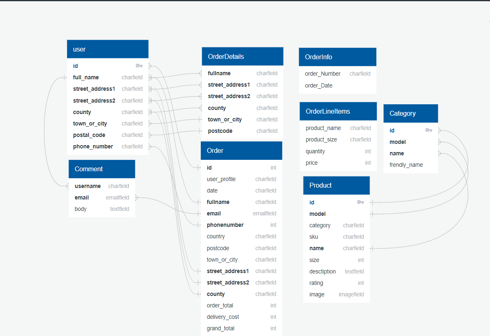

## **Surface**
### Background Image
___

Below image has been used as background image on the landing page in the project.
* Provides the user with a clear and consistent visual structure, which clearly indicates relationships between elements on the screen, improves navigation, and the order of importance of elements that matches user's expectations. 
* Communicates what user expects, what information or value that users want to get, and considers user capabilities.

### Font
 * Manrope, san-serif font has been used all over the project.
___

:arrow_up:[Back-to-top](#contents)

# **Technologies and Frameworks Used**

* [Python3](https://www.python.org/)
* [Jinja](https://jinja.palletsprojects.com/en/3.0.x/) - used  with python for  working of the website
* **Django** - Python web framework for building apps.
* **HTML** - used for creating the website.
* **CSS** - used for styling the website.
* **Bootstrap** - used to support javascript extensions.
* **Javascript** - used for allauth messages.
* **JSON** - used for products and categories format storage.
* [jQuery](https://jquery.com/) - used for confirmation messages and interactive design.
* [balsamiq](https://balsamiq.com/wireframes/) - used to create wireframes.
* [Gitpod](https://www.gitpod.io/) - used to built all project.
* [GitHub](https://github.com/) - used to hosting the website.
* [Heroku](https://id.heroku.com/) - used to deploy the website.

:arrow_up:[Back-to-top](#contents)

# **Features**

  ###  Existing Features
 ___
 * ### **Navigation bar**
    The nav bar feature is fixed in desktops and if resized turns into a hamburger icon in mobile and tablet screen and coresponding link will display from left side.

 * ### **Home / Landing page** -> Yoga Emporium [logo font]
 
 * The Home page feature have the search panel at the top.
    If user enters a word , it displays the results below the panel it takes data from product name, and description. otherwise it displays a message - '0 Products found for "name you have entered".
    By clicking on "Yoga Emporium" logo Icon retrieves the home page.
 * Menu - All Products, Clothing, Essetials, Special offers.
 * My Account Icon has profile and logout dropdown.
 * News Icon 
 * Bag Icon
 * Delivery Banner
 * Sort by scroll bar
 * Shop Now button on the mid screen.
 
*   ### My Account --> Product Management --> Register --> Login

* ### Product Management (only for admin/store owner)
    * Product Management feature is only accessible to Admin / Store owner. If clicked on Product Management it will route to add product page and displays form which has Category, SKU, Name, Description, size, price and Rating. It has 3 buttons, Select Image, Cancel and Add product. When clicked on Select Image button , any image can be added from your local folder,when clicked on cancel it will route to Products page and when clicked on add product it will route to Products page and success message is popped up as "Product added". 
    * Cliking on the product details, it will route to product details page and has edit / delete button, 
    * Clicking on the Edit button the Admin / Store owner will be routed to the Edit product page, and Alert message is popped as "You are editing product name"
    * Clicking on the Delete button, the product is deleted and success message pops up as "Successfully deleted"

 * ### Register page
    * The register page  feature will help first time user to register to the page and create a login. username field is a string which has to be 4 characters and more, including lower and upper case and any number(alphanemeric)
    
    * User has to enter Email, Email address confirmation, Name, Username, Password and Password again.
    Error message is displayed to enter mandatory fields(if nothing is entered).
    if the user enters wrong username / password the flash message will pop out to alert  user to enter the correct credentials. * Clicking the signup button the user will be routed to the Products page and flash message diplays "Signup successfull"

 * ### Login page
The Login page feature will help the user to login to the website. The username field has to be a 4 characters and more, Error message is displayed to enter mandatory fields(if nothing is entered) as "The username and/or password you specified are not correct.. Clicking the sign in button the user will be routed to the Home page.

 * ### My Profile -> Update Information 
 My profile page feature will display default delivery infomration form, update information button on the page and the order history. when clicked on Update information button after filling the form, the order is updated and and success message will display and stays on the same page.
 
* ### Logout 
  * The logout function displays the signout form and confirmation button and cancel button. When clicked on the signout button it will be routed to back to Home page.

* ### Feedback App -> News -> Leave a Comment
  * The News menu displays the latest news from admin / Store owener on the top and readmore button on that it displays name, date,time and the Latest News in a card, when read more button is clicked it will route to comments section and a form "Leave your comment" where users can enter name, email and body of the message and post the comment by clicking submit button. You will see "your message is awaiting approval".

* ### Bag App -> Your bag is empty / Add Products -> Secure Checkout -> Adjust quantity -> Checkout -> Order History -> Confirmation Email 
    * The Bag app will display the grand total, products in the bag if added or just an empty bag information and go to "shop now" button. The will be routed to All products age.
    * If you add an product, Bag icon color changes to blue, Message appears on top right corner saying that "the product is added to your bag". Then Secure checkout  option will be on the display where you can click that and go to checkout page.
    * In checkout page will display the grand total of the products added and you can adjust the quantity of the bag manually typing number or num stepper and click on add to bag button.
    * Secure checkout button will route to the Confirm order form (consists of card details cvv and expiry date) and a confirm order button will route to the order history page and confirmation email sent message pop-up is displayed.
    * Order History Page also has a button to go back "Now checkout the latest deals" and it route to the Products page.

### All products
* All products nav item has 4 dropdowns :-
    * By price :- When clicked , it will sort the products by price in asc order and displays on the screen.
    Also has hover button on the top to display which category you are viewing.
    * By Rating :- When clicked, it will sort the products by rating in desc order and displays on the screen.
    Also has hover button on the top to display which category you are viewing.
    * By Category :- When clicked, it will sort alphabetically (category) and displays on the screen.
    Also has hover button on the top to display which category you are viewing.
    * All Products :- When clicked, it will sort alpabetically (product name) and displays on the screen.
    This feature also have all 3 categories hover button on the top to swap the category.

### Clothing
 * Clothing nav item has 4 dropdowns :-
    * Acivewear :- When clicked , it will sort the products category Activewear and displays on the screen.
    Also has hover button on the top to display which category you are viewing.
    * Pants :- When clicked, it will sort the products category Pants and displays on the screen.
    Also has hover button on the top to display which category you are viewing.
    * Shirts :- When clicked, it will sort products category Shirts and displays on the screen.
    Also has hover button on the top to display which category you are viewing.
    * All clothing :- When clicked, it will sort Activewear, Pants and Shirts and displays on the screen.
     This feature also have all 3 categories hover button on the top to swap the category.

### Essentials
 * Essentails nav item has 3  dropdowns :-
    * Mats and Blocks :- When clicked , it will sort the products by category Mats and Blocks and displays on the screen.
    Also has hover button on the top to display which category you are viewing.
    * Antiques and Idols :- When clicked, it will sort the products by category Antiques and Idols and displays on the screen.
    Also has hover button on the top to display which category you are viewing.
    * Other :- When clicked, it will sort products category Mats&Blocks, Antiques&Idols and displays on the screen.
     This feature also have all 3 categories hover button on the top to swap the category.

### Special Offers
 * Speacial Offers nav item has 4 dropdowns :-
    * New Arrival :- When clicked , it will sort the products category New arrival and displays on the screen.
    Also has hover button on the top to display which category you are viewing.
    * Deals :- When clicked, it will sort the products category Deals and displays on the screen.
    Also has hover button on the top to display which category you are viewing.
    * Clearance :- When clicked, it will sort products category Clearance and displays on the screen.
    Also has hover button on the top to display which category you are viewing.
    * All specials :- When clicked, it will sort New arrival, Deals, Clearance and All specials and displays on the screen.
     This feature also have all 3 categories hover button on the top to swap the category.

### Delivery Banner
* This Delivery banner is set on the top of screen and will be visible all time at the top. 'Marquee' element tag has been implemented to the sentence.

### Sort by scroll bar
* Sorting feature has been implement as below.
    * Price (low to high)
    * Price(high to low)
    * Rating(low to high)
    * Rating(high to low)
    * Name(A-Z)
    * Name(Z-A)
    * Category(A-Z)
    * Category(Z-A)

### SHOP NOW Button
*   The shop now button on the screen, when clicked route to Products page. Shoppers can easily navigate to Products page.

### Footer
The footer feature is only displayed on All products page, have social media links and copyright information. when clicked the social links opens in the new tab.

### Other Features 
* Nav bar is a container fluid and will stick to the top at all time.
* Overlay effect has been implemented to other pages to overlay the background Image which will be visible all the time on the home page.

### Features left to Implement

 ### Home app Page :- 
* Carosel Images.
* Contact Form.
* Home page LOGO.

 ### Product app page :-
* Discount coupons logic on purchasing over 50$.

 ### Product Management :-
 * Confirmation message modal before deleting the product(Admin/Superuser).

 ### News app Page :-
 * Adding Images.
 
 <!---News app template name has been changed for the better user experience but it is implemented as feedbacks in the project since the News name suits the functionalities--->

  

:arrow_up:[Back-to-top](#contents)

# **Testing**
___

 * ### **Code Validity**
    Code validity was performed by the following tools and passed except warnings due to HTML validator was unable to recognize Jinja templates.

    * HTML Markup Validation (https://validator.w3.org/)
    * CSS Validation (https://jigsaw.w3.org/css-validator/)
    * JSHint (https://jshint.com/)
    * PEP8 online (http://pep8online.com/)

* ### **Testing user stories**  
     * [_non-registered_](static/images/testing/registered-users.png)
     * [_registered_](static/images/testing/non-registered-users.png)
     * [_store-owner_](static/images/testing/admin_testing1.png)
     * [_store-owner_](static/images/testing/admin_testing.png)
     * [_store-owner_](static/images/testing/product-management.png)
     * [_store-owner_](static/images/testing/add_product.png)

* ### Non Registered users
    *   As a guest user to the yoga emporium website, I want to easily navigate through the site, so that I can search the all the products I need that are
listed on the website.
    *   The Home page serves as an entry point to look in and nav bar has all categories of the products on the website, login and
register option, news page and the shopping bag.
    *   As a guest user to the yoga emporium website, I want register/log-in functions, so that I can have my own profile created.
    *The home screen has “My Account” option to help users easily understand and register to the website.
    *   As a guest user to the yoga emporium website, I want to use the search panel to find products by part or full product name or description.
    *   The search panel is clearly labelled and easily accessible from the Home Page.
    *   As a guest user to the yoga emporium website, I want to see the links to different social media accounts, to contact or follow the website on social media.
    *   The social media links are clearly visible on the footer bar and easily accessible all the time.
    *   As a guest user to the yoga emporium website, I want to see the news about the latest updates on the yoga and its benefits.
    *   As a guest user to the yoga emporium website, I want to leave a comment on the new item posted.
    *   The comment that is posted will “awaiting moderation” by the admin and will be posted on the news page once approved.
    *   As a guest user to the yoga emporium website, I want to have a shopping bag button. If clicked on the shopping bag it should ask to sign-up/sign-in.
    *   As a guest user to the yoga emporium website, I want to have the marquee tags on the nav bar to display the latest offers.

* ### Registered users

    *	As a registered user to the yoga emporium website, I want to easily navigate through the site, so that I can search the all the products I need that are listed on the website.
    *	The Home page serves as an entry point to look in and nav bar has all categories of the products on the website, login and register option, news page and the shopping bag.
    *	As a registered user to the yoga emporium website, I want to have log-in function, using which in can access my profile.
    *	The home screen has “My Account” option to help user easily understand and login to the website.
    *	As a registered user to the yoga emporium website, I want to search for the products on the website and add it to the shopping bag.
    *	The navigation bar has shopping bag option to help user easily understand and check what is added in their shopping bag.
    *	As a registered user to the yoga emporium website, I want to search for the product I want to buy on the website and add it to the shopping bag.
    *	User can easily access the products based on the categories and sorted by price or rating or categories.
    *	As a registered user to the yoga emporium website, I want to access the shopping bag and update the quantity or remove the items from the shopping bag.
    *	User can easily access shopping bag from the Nav bar and update the quantity of the items added.
    *	As a registered user to the yoga emporium website, I want to securely checkout from the shopping bag.
    *	Once user adds the items in the shopping bag, they can securely checkout from the shopping bag.
    *	As a registered user to the yoga emporium website, in the shopping bag, I want to display the remaining amount to shop for getting the free delivery.
    *	Once the user adds an item to the shopping bag, a message is displayed showing the total amount on the items, the delivery charges and the grand total is displayed and below that a message is displayed showing the remaining amount to shop for getting the free delivery.
    *	As a registered user to the yoga emporium website, after adding the products, go to checkout page where I can fill out a form to complete the order.
    *	Once the user goes to the checkout page, user had to fill out the form with the details of delivery with full name, email address, phone number, delivery address with postal code and country.
    *	As a registered user to the yoga emporium website, after adding the delivery details form, have a checkbox to save the delivery information to my profile, so that I can quickly add these details next time.
    *	As a registered user of the website, I want to have the option of adding the payment card details with card number, expiry details and CVC number.
    *	As a registered user to the yoga emporium website, I want to complete the order after adding all the delivery details.
    *	In this checkout page, there should also be an option to go back and adjust bag and on the right-hand side the order summary to be displayed.
    *	As a registered user to the yoga emporium website, if you click on the “complete order” without entering the details it should show a toast message to fill the mandatory fields.
    *	As a registered user to the yoga emporium website, I want to display a toast message on the right top corner of the page when I sign-in.
    *	As a registered user to the yoga emporium website, I want to display a toast message on the right top corner of the page when I sign-out.
    *	As a registered user to the yoga emporium website, I want to display a toast message on the right top corner of the page when I adjust the bag.
    *	As a registered user to the yoga emporium website, I want to display a toast message on the right top corner of the page when an email confirmation is sent for password reset.
    *	As a registered user to the yoga emporium website, I want to display a toast message on the right top corner of the page when I securely checkout the items added in the shopping bag.

* ### Admin User / Store owners
        
    *	As a admin / store owner user of the yoga emporium website, I want to have access to administrate the whole website.
    *   As a admin / store owner user of the yoga emporium website, I want to add categories and products and update or delete them as and when required.
    *   As a admin / store owner user of the yoga emporium website, I want to add news items on the website.
    *   As a admin / store owner user of the yoga emporium website, I want to moderate the comments entered by the users on the news items.
    *   As a admin / store owner user of the yoga emporium website, I want to administer the users and groups on the website.
    *   As a admin / store owner user of the yoga emporium website, I want to administer the email addresses of the users on the website.
    *   As a admin / store owner user of the yoga emporium website, I want to view and update the order history on the website.
        

:arrow_up:[Back-to-top](#contents)

* ### **Functionality testing**
    * ### Manual Testing

        * #### Home Page
            * Navigation Bar :-The  Navbar is fixed and is visible across all pages and on all screen size devices and is working as expected and it collapses into a hamburger menu on Tablets and smaller devices.
            * My Account Menu :- when clicked collapse to My profile and login page (for registered users)as expected,
            when clicked collapse to Register and login page (Non registered users) as expected.
            * Register Menu :- when clicked, Redirects to Register page as expected
            * The Logo font :- when clicked, redirects to the Home page, works as expected.
            * All Products :- when clicked, collapse to - by category, by price, by rating and all products, works as expected
            * Clothing :- when clicked, collapse to Activewear, Pants, Shirts and All clothing, works as expected.
            * Clothing :- when clicked, collapse to Mats -Blocks, Antiques-Idols and others, works as expected.
            * Special Offers :- when clicked, collapse to New arrvals, Deals, Clearance and all special, works as expected.
            * News Menu :- when clicked, it route to new page.
            * Bag Menu
            * Footer :-The footer is relative and transparent background visible on Home page. It consists of four social links. When clicked on social links it opens in a new tab of respective social link, works as expected.
            * Search button :-Tried and tested by giving input Product name category name and Descriptions
            when typed non existing Products it displays as "0 results found". Clicking on the Search button without entering any value - Error alert "You didnt enter any search criteria" is Popped up, prompting users to enter a value, works as expected.
            * Shop Now button on screen :- when clicked route to products page, works as expected.
            * Bag Menu :- when clicked route to users bag and displays product which is added. Or just an empty bag information.works as expected.

        * #### Profile Page
            * Clicking on the navigation bar's Profile link has been routed to the user's profile page, works as expected.
            * Clicking on Profile page, Dafault delivery information and order history is displayed.
                * Update Information button :- Updates information after entering the order form and success alert pops up and stays in the same page.works as expected.

        * #### Logout page
            * Clicking on the navigation bar's logout  link has been route to the logout confirmation page.
                * Clicking on Cancel button route to Home page.
                * Clicking on the Sign out button route to Home page, Success alert "you have signed out". 
                Logout page works as expected.

        * #### Login page 
            * Clicking on Login page, route to sign-in page form to enter details. If entries are wrong, error is displayed "The username and/or password you specified are not correct" if entries are correct it will route to Home page Alert Success alert is displayed saying "Successfully signed in as Username".works as expected.

        * #### News page.
            * Clicking on News button it route to Latest news page. Where the latest news is displayed first with name, date and time.
            * Clicking on Read more buttons route to Comments Page. Latest comments will be displayed under the latest news and a comment form below. works as expected.
            * Clicking on submit button in leave a comment form will post the comment and message is displayed on screen saying awaiting approval.
            * Clicking on Go back to  News page will route back to News page.
            **All above fields works as expected**.

        * #### Bag page of user's profile.
            * Clicking on the Bag menu, will displays the products in the bag.
            * Clicking on the add to bag menu, the producta will be add for checkout.
            * Clicking on keep shopping button route back to products page.
                * ### Secure checkout page
                * Clicking on secure checkout button leads to shopping bag page and users can adjust the bag , size(if any)
                amd click on secure checkout.
                * Clicking on the keep shopping  button leads to products page back.
                * Clicking on Secure checkout inside shopping bag will route to Checkout form for the delivery details filling and the Payment process.
                * Clicking on Complete order will authenticate and overlay will be loaded to authorize and if the card number and details are correct it completes the order and alert success message displays saying order is confirmed and confirmation email has been sent to given address and page route back to Checkout success page. Else 
                Error message is displayed below the payement row "Enter the valid card details",
                * Clicking on Adjust bag button will route back to shopping bag to secure checkout again or adjust the quantity and size.

            **All above fields of Bag app works as expected**.

        ### Functionality testing for Admin / Store Owner
        * **Product Management** : Clicking on Product management under My account menu will route to add product page, where admin or store owner can add product by filling out the product details and clicking on add product. Success alert is displayed saying "Successfully added product" with noimage as default.
        * **Edit product** : Clicking on edit button under the product detail page will route to product management page.
        Image remove is also working as expected. Clicking Update product will route back to product detail page and Success message alert saying "Successfully updated product" cancel button route back to products page.
        * **Delete product**: Clicking on Delete button on the product detail page will delete the product and Success message is displayed "Product deleted"
        " Edit / Delete buttons are also visible on card body of the Individual products.

    * ### Defensive design testing

    * **Registration attempt with an existing Username**.

        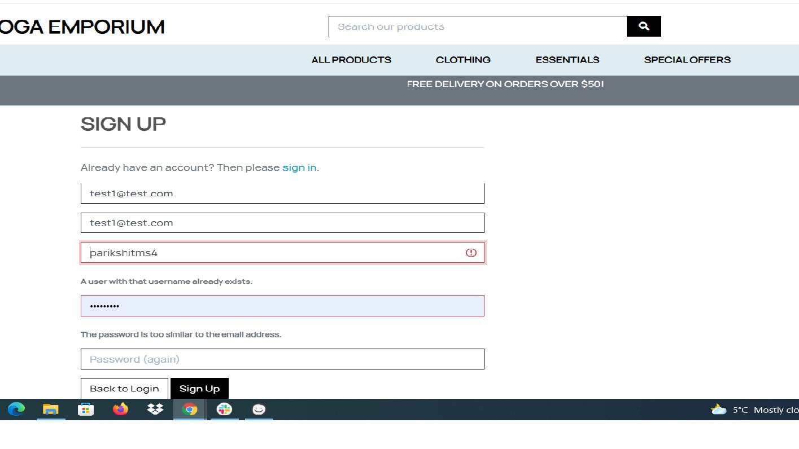

    * **Login attempt with an unmatching Username / Password fields**.

        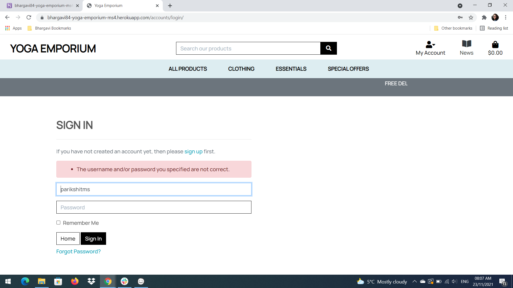

        
    * **Search results error**.

        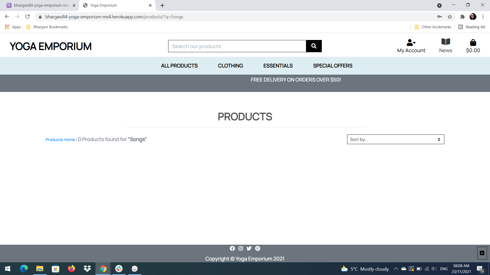

    * **Error in payment process. Always fails with a decline code of insufficient_funds**.

        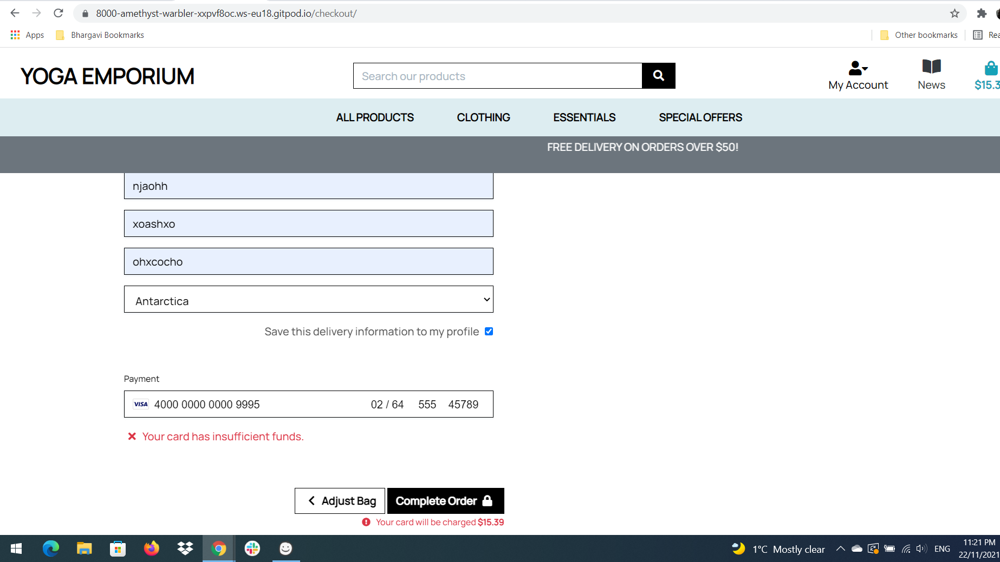

    * **Card Invalid**

        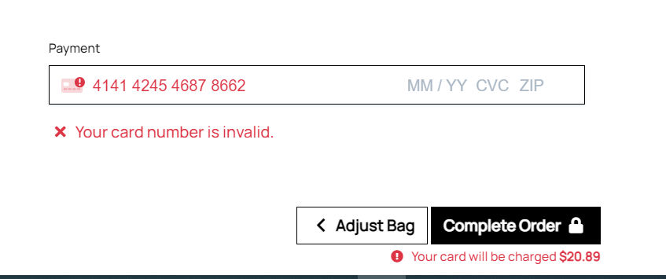

    * **Authentication Error**

        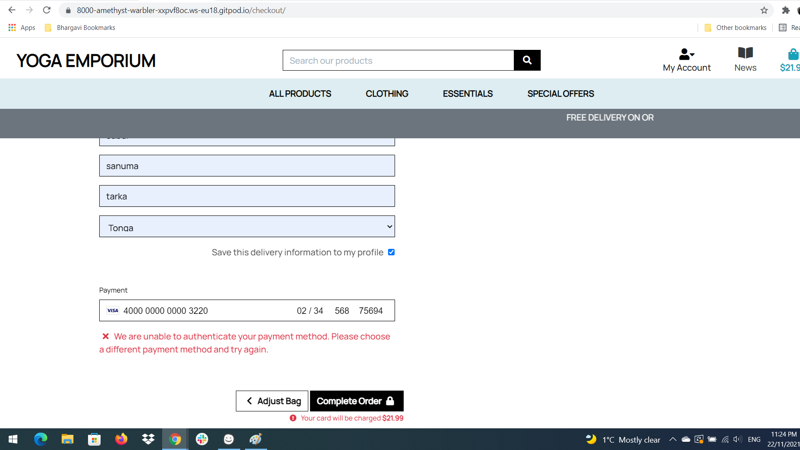

:arrow_up:[Back-to-top](#contents)

* ### **Responsiveness**
    The responsiveness of the website was tested physically on Laptops, Desktops, Big screen, Mobile, Tablets.
    The website fits and adapts fairly ok to the different viewport size devices.
    
* ### **Usability Testing**
    * This website have been shared to family and friends Register, Login and Add products to bag, Post comments and checkout with Test cards(4242424242424242) any cvv and any expity dates. During the testing process it was confirmed that the website was easy to use and navigate. They were able to effectively use the interactive elements of the website, find the information they were looking for and easily understand the purpose of the website. Post the comments for the latest news and get the alert messages and confirmation Emails properly.
* ### **Performance testing**
    Performance testing was carried out using Lighthouse in Chrome Developer Tools.
    * Desktop Performance was excellent in accessibility.
    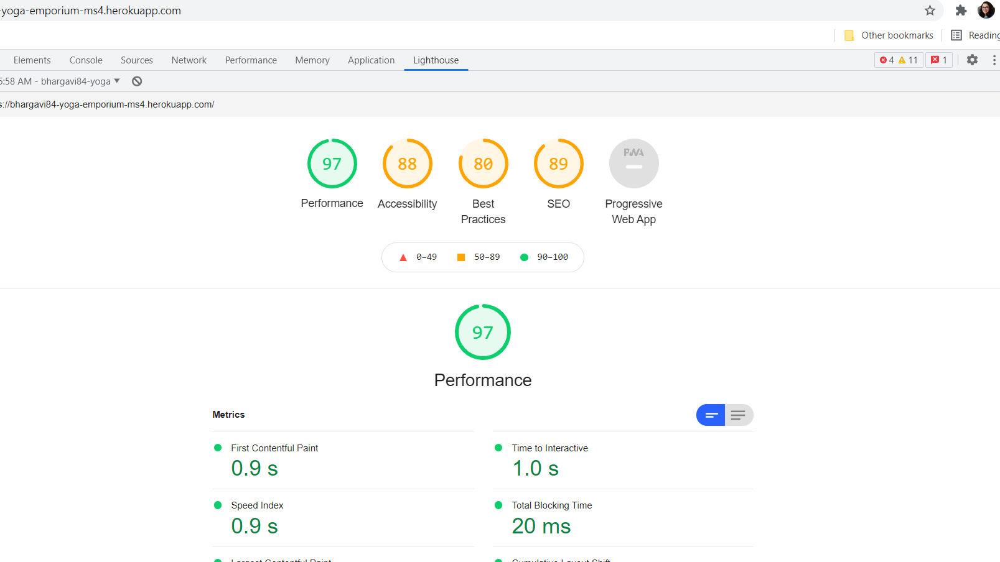
    * Mobile - Performance was in average accessibility
    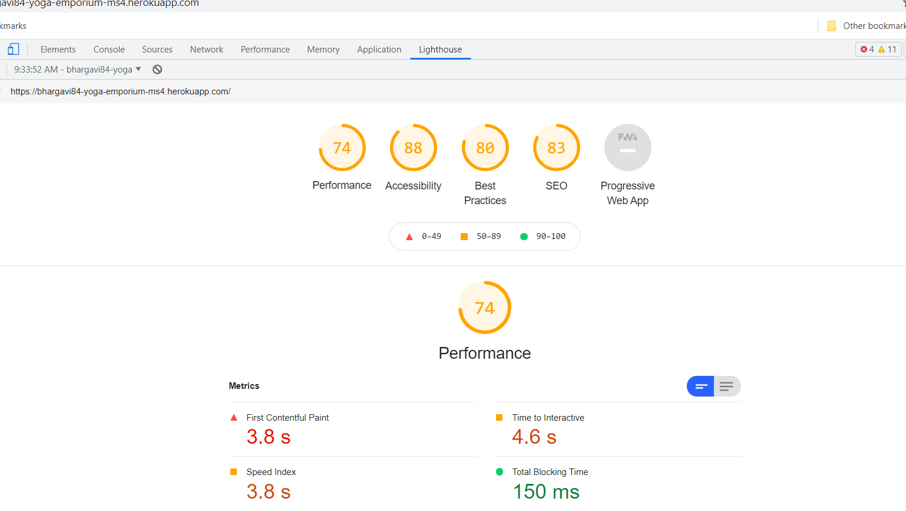

:arrow_up:[Back-to-top](#contents)

# **Deployment**
* This website is developed by using Gitpod workspace and GitHub repository to commit and push changes. This project uses GitHub for hosting and has been deployed using Heroku and also Amazon S3 for storing the media files.

* Following steps can be used to access the page :-

### **Download**
* Git hub navigate to https://github.com/Bhargavi84/yoga-emporium
* Click the **Code** button.
* Click the **Download Zip**.
* Extract 

### **Clone Repository**

* GitHub navigate to https://github.com/Bhargavi84/yoga-emporium
* Click the Code button.
* To clone with HTTPS copy the URL in the box https://github.com/Bhargavi84/yoga-emporium.git
* Open your Git Bash.
* Changed the directory to the location where you want to clone.
* Type git clone than paste the copied URL git clone https://github.com/Bhargavi84/yoga-emporium.git
Press Enter , your local clone will be created.

### **Deployment to Heroku**
* **Set up workspace for Heroku**:

    * In the terminal window of IDE, create a requirements.txt file to store all applications and dependencies required to run the project.
    *        pip3 freeze --local . requirements.txt

    * Create a Procfile (strictly capital P and no file extension!) - required by Heroku, to know which file runs the app.

    *          pip3 install gunicorn

    *          web: gunicorn yoga_emporium.wsgi:application 
    
* **Create application in Heroku**:

    * Navigate to [Heroku website](https://dashboard.heroku.com/) and create an account.
    * Once logged in, click on the New button and select Create New App
    * Create a name for your app and select the region closest to your location.
    * Get free Hobby dev Heroku Postgres

* **S3 Bucket Creation using AWS**

* AWS is Amazon’s cloud-based storage service is used to store this project's static and image files.
    * Create an account if you don't have one already. Click on "Create new aws account" follow instructions.
    * Once login is created, Navigate to the AWS management console.
    * In the search bar search s3, this can be found in the services section. Open s3 and create a new bucket.
    * Enter the name of your bucket (to keep things consistant give the name which matches your respective project).Select the region that is closest to you.
    * Uncheck block public access box. Then click create bucket.
    * Once you have created the bucket, click on the bucket, and enter the following details-
        * Under Properties, turn on static website hosting
        * Under Permissions, paste in the CORS configuration:

        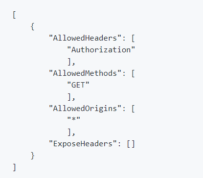 

* Navigate to bucket policy and select policy generator. This will create a security policy for the bucket.
* Policy type will be s3 bucket policy, allow all principles by selecting the star. For action select get object.
* Copy the ARN (Amazon resource name) from the bucket policy tab. Paste the copied ARN into the box at the bottom. Once added click Add Statement. Click Generate Policy, copy this policy into the bucket policy editor.
* Do not click save yet. First allow access to all resources in the bucket. You can do this by add "/*" at the end of the resource key.
* Go to access control list tab and set the list objects permission for everyone under the Public Access section.
* Now that the s3 bucket is set up. You now need to create a user in order to access the bucket. To do this use another    Amazon service called IAM (identity and Access Management).
* In the search box type in IAM and click on the result.
* Click groups and create a new group. Do not worry about any of the tabs, click all the way through to create the group.
* Create the policy to access the bucket by clicking policies and then create policy.
* Navigate to the JSON tab, import managed policy, search for s3 and import S3 Full Access Policy.
* Go back to the bucket policy page and copy the ARN, paste the ARN in the JSON section.
* Click review policy, give the policy a name (project name + policy at the end) and a description, then click create policy.
* Attach the policy to the group that was just created. Go to groups, manage my group, click attach policy, search for the policy that was just created and select it. Then click attach policy.
* Create a user for the group. On the user's page, click add user, create a new user and give them programmatic access. Then select next.
* Add newly created user to group. Download the CSV file, this file contains the users access key and secret access key. 
* These keys are needed to authenticate the user from the Django app. MAKE SURE YOU SAFELY STORE THE CSV FILE, IT CAN NOT BE SEEN OR DOWNLOADED AGAIN
* Connect Django to s3, you'll need to install 2 new packages :
* pip3 install boto3
* pip3 install django-storages
* Freeze requirements.txt
* pip3 freeze > requirements.txt
* Add 'storages' to installed apps in settings file
* To connect Django to s3, you'll need to add some parameters in settings to tell Django which bucket it is communicating with

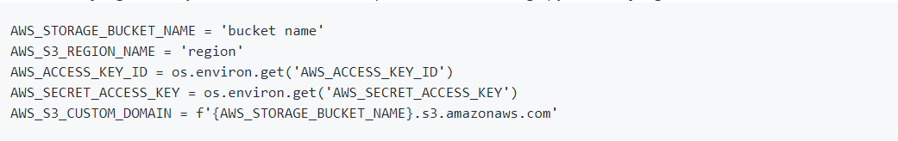 

* Go to Heroku, in the convig vars, add USE_AWS = True. Add the AWS access key and secret access key
* Remove disable collectstatic from Heroku config vars
* Create a file called custom_storages.py
* In settings.py add the following statements to tell Django where the static files will come form in production

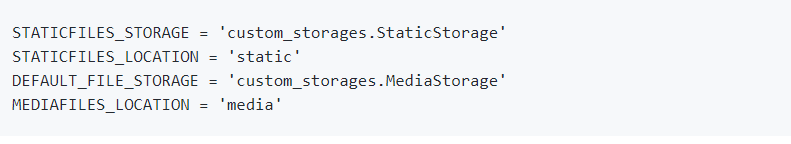 

* Then git commit all changes

* **Connect your app to GitHub repository**:

    * On the Deploy page, select GitHub as your Deployment method.
    * You will then be prompted to find the github repository, click on Connect button to connect.
    * Choose a branch to deploy as main.
    * Click on the Settings  and select Config Vars and Reveal Config Vars.
    * Add the following variables.

    

* Now go back to Heroku and click on Enable Automatic Deployment and Deploy Branch.

  * https://git.heroku.com/bhargavi84-yoga-emporium-ms4.git

* The app is now connected and Heroku will receive the code from GitHub and will access the static files and media files using S3 bucket from AWS and automatically updates whenever changes is pushed to the GitHub repository. You should be able to see "Your app was successfully deployed!". Click on View to launch your app.
* Click on Open App to test your deployed website.

## **Fork the project**

* To create a personal copy of this repository, click on Fork button on the top right corner of the repository page in GitHub.

### **Database Access**

* Heroku Postgres for production
* sqLite3 for development
* AWS S3 for static and media files

* SQLite, by Django has been used for development. Heroku Postgres has been used for production. Amazon Web Services (AWS) has been used to host all my static and media files.

### **Database Structure**

:arrow_up:[Back-to-top](#contents)

# **Credits**

### Code
____

* Inspiration by Boutique Ado Project from Code Institute.
* AWS section in Readme ideas credits to lawrence-collections-ms4.

### Design
___

* Design Inspiration from Boutique Ado project
* Social links and credits to lawrence-collections-ms4.

## References
___

* https://djangocentral.com/building-a-blog-application-with-django/ 
* W3Schools 
* Boutique Ado Walk through project
* Code Institute course material.
* StackOverflow
* https://www.youtube.com/watch?v=CnaB4Nb0-R8

## Media
___

* The Images for this project was downloaded from the below websites. 

* https://burst.shopify.com/yoga 
* https://pixabay.com/images/search/yoga/
* https://unsplash.com/s/photos/yoga-pants
* https://www.freepik.com/free-photos-vectors/yoga-mat
* https://www.pexels.com/search/yoga/

## Acknowledgements
___

* My mentor Spencer Barriball for his guidance and support throughout the project.
* Code Institute's Student care Team,Tutors and Slack Community for help and support.

## Disclaimer
___

* This project is purely educational purpose only.

:arrow_up:[Back-to-top](#contents)